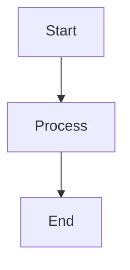

# Song Virality Prediction System - Diagrams

This directory contains architectural and design diagrams for the Song Virality Prediction System using Mermaid diagram syntax.

## 📊 Available Diagrams

### 1. [Entity Relationship Diagram (ERD)](./erd-diagram.md)
Shows the data model with all entities (SONG, PREDICTION, MODEL, ARTIST, LANGUAGE, AUDIO_FILE) and their relationships.

### 2. [System Architecture Diagram](./architecture-diagram.md)
Illustrates the complete system architecture with:
- React Frontend (Port 5173)
- Flask Backend API (Port 5001)
- ML Components and Data Layer

### 3. [Use Case Diagram](./usecase-diagram.md)
Displays actors (User/Music Producer, System Admin) and their interactions with the system.

### 4. [Activity Diagram](./activity-diagram.md)
Shows the complete prediction workflow from user input to result display.

### 5. [Data Flow Diagram](./dataflow-diagram.md)
Depicts the data preprocessing pipeline from raw CSV to training-ready dataset.

### 6. [Component Diagram](./component-diagram.md)
Details all frontend, backend, and ML components and their relationships.

### 7. [Deployment Diagram](./deployment-diagram.md)
Shows the Vercel deployment architecture with all dependencies.

## 🎨 How to View the Diagrams

### On GitHub
GitHub natively renders Mermaid diagrams. Simply click on any `.md` file in this directory to view the diagram.

### In VS Code
Install the "Markdown Preview Mermaid Support" extension:
```bash
code --install-extension bierner.markdown-mermaid
```
Then open any diagram file and press `Ctrl+Shift+V` (or `Cmd+Shift+V` on Mac) to preview.

### Online Mermaid Editor
Copy the diagram code and paste it into the [Mermaid Live Editor](https://mermaid.live/) for interactive viewing and editing.

### In Documentation Sites
If using MkDocs, Docusaurus, or similar tools, install the appropriate Mermaid plugin:
- **MkDocs**: `mkdocs-mermaid2-plugin`
- **Docusaurus**: Built-in support with `@docusaurus/theme-mermaid`

## 📝 Diagram Syntax

All diagrams use [Mermaid](https://mermaid.js.org/) syntax, a Markdown-inspired text notation for creating diagrams from text.

### Example:


## 🔧 Updating Diagrams

To modify any diagram:
1. Open the corresponding `.md` file
2. Edit the Mermaid code within the code fences
3. Preview changes using one of the methods above
4. Commit and push your changes

## 📚 Reference

- [Mermaid Documentation](https://mermaid.js.org/)
- [Mermaid Diagram Types](https://mermaid.js.org/intro/)
- [Mermaid Live Editor](https://mermaid.live/)
