# Activity Diagram

This flowchart shows the complete user journey and system workflow for predicting song hit probability.

## Diagram

```mermaid
flowchart TD
    Start([User Opens Application]) --> LoadApp[Load React App<br/>Initialize State]
    LoadApp --> ChooseMethod{Choose Input<br/>Method}
    
    %% Manual Input Path
    ChooseMethod -->|Manual Entry| ManualForm[Display Form with<br/>12 Musical Features]
    ManualForm --> EnterFeatures[User Enters Values:<br/>danceability, energy, key,<br/>loudness, mode, speechiness,<br/>acousticness, instrumentalness,<br/>liveness, valence, tempo,<br/>duration_ms]
    EnterFeatures --> ValidateManual{Validate<br/>Input}
    ValidateManual -->|Invalid| ShowError1[Show Error:<br/>Invalid values or<br/>missing fields]
    ShowError1 --> ManualForm
    ValidateManual -->|Valid| PrepareRequest[Prepare JSON Request<br/>with Features]
    PrepareRequest --> SendAPI1[POST to<br/>/api/predict]
    
    %% Audio Upload Path
    ChooseMethod -->|Audio Upload| AudioPage[Display Audio<br/>Upload Interface]
    AudioPage --> SelectFile[User Selects<br/>Audio File]
    SelectFile --> ValidateFile{Validate<br/>File Type}
    ValidateFile -->|Invalid| ShowError2[Show Error:<br/>Unsupported format<br/>Use .mp3, .wav, .flac]
    ShowError2 --> AudioPage
    ValidateFile -->|Valid| UploadFile[Upload File to<br/>/api/analyze-audio]
    UploadFile --> ExtractFeatures[Librosa Extracts<br/>12 Musical Features]
    ExtractFeatures --> CheckExtraction{Extraction<br/>Successful?}
    CheckExtraction -->|Failed| ShowError3[Show Error:<br/>Cannot process file<br/>Use defaults]
    ShowError3 --> UseDefaults[Use Sensible<br/>Default Values]
    UseDefaults --> SendAPI2[Prepare Features]
    CheckExtraction -->|Success| SendAPI2
    
    %% Backend Processing
    SendAPI1 --> LoadModel{Model<br/>Loaded?}
    SendAPI2 --> LoadModel
    LoadModel -->|No| LoadModelNow[Load XGBoost Model<br/>from models/*.pkl]
    LoadModelNow --> CheckLoad{Load<br/>Successful?}
    CheckLoad -->|Failed| ShowError4[Show Error:<br/>Model unavailable<br/>503 Service Unavailable]
    ShowError4 --> End1([End with Error])
    CheckLoad -->|Success| ClampFeatures
    LoadModel -->|Yes| ClampFeatures[Clamp Feature Values<br/>to Valid Ranges]
    
    ClampFeatures --> MakePrediction[XGBoost Model<br/>Predicts Hit Probability]
    MakePrediction --> CalculateScores[Calculate:<br/>- Hit Probability 0-1<br/>- Confidence Score<br/>- Classification hit/miss]
    CalculateScores --> ReturnResult[Return JSON Response<br/>with Prediction]
    
    %% Frontend Result Display
    ReturnResult --> DisplayResult[Display Results:<br/>- Hit Probability %<br/>- Confidence Level<br/>- Visual Indicators]
    DisplayResult --> CheckProbability{Hit Probability<br/>< 70%?}
    CheckProbability -->|Yes| FetchSuggestions[POST to<br/>/api/suggest-improvements]
    FetchSuggestions --> ShowSuggestions[Show Top 5 Improvements:<br/>- Feature to change<br/>- Direction INCREASE/DECREASE<br/>- Expected improvement<br/>- New probability]
    ShowSuggestions --> UpdateScore
    CheckProbability -->|No| ShowSuccess[Show Success Message:<br/>Great potential for a hit!]
    ShowSuccess --> UpdateScore[Update Gamification:<br/>- Calculate points<br/>- Add bonus for confidence<br/>- Save to localStorage]
    
    UpdateScore --> LogPrediction[Log Prediction:<br/>- Timestamp<br/>- Features<br/>- Result<br/>- Score earned]
    LogPrediction --> SaveState[Save State to<br/>localStorage]
    SaveState --> AskContinue{User Wants to<br/>Try Another?}
    AskContinue -->|Yes| ChooseMethod
    AskContinue -->|No| End2([End Session])
    
    %% Styling
    classDef userAction fill:#b3d9ff,stroke:#333,stroke-width:2px
    classDef validation fill:#ffffb3,stroke:#333,stroke-width:2px
    classDef processing fill:#d9b3ff,stroke:#333,stroke-width:2px
    classDef error fill:#ffb3b3,stroke:#333,stroke-width:2px
    classDef success fill:#b3ffb3,stroke:#333,stroke-width:2px
    
    class EnterFeatures,SelectFile,ManualForm,AudioPage userAction
    class ValidateManual,ValidateFile,CheckExtraction,LoadModel,CheckLoad,CheckProbability validation
    class LoadModelNow,ExtractFeatures,ClampFeatures,MakePrediction,CalculateScores processing
    class ShowError1,ShowError2,ShowError3,ShowError4 error
    class ShowSuccess,DisplayResult,ShowSuggestions success
```

## Activity Flow Description

### Phase 1: Application Start
1. User opens the application in browser
2. React app loads with App.jsx as main state manager
3. Layout component initializes (loads theme, score, logs from localStorage)
4. User chooses between two input methods

### Phase 2A: Manual Input Path
1. **Display Form**: Show input form with 12 musical feature fields
2. **User Entry**: User manually enters all feature values
3. **Validation**: Frontend validates:
   - All fields filled
   - Values within valid ranges (e.g., danceability 0-1, key 0-11)
4. **Error Handling**: If validation fails, show error and allow correction
5. **API Request**: Prepare JSON with features, POST to `/api/predict`

### Phase 2B: Audio Upload Path
1. **Display Interface**: Show audio file upload interface
2. **File Selection**: User selects audio file from device
3. **File Validation**: Check file format (.mp3, .wav, .flac supported)
4. **Error Handling**: If invalid format, show error and allow reselection
5. **Upload**: Send file via multipart/form-data to `/api/analyze-audio`
6. **Feature Extraction**: Backend uses Librosa to extract 12 musical features
7. **Extraction Check**: If extraction fails, use sensible default values

### Phase 3: Backend Processing
1. **Model Check**: Verify XGBoost model is loaded in memory
2. **Load Model**: If not loaded, load from `models/song_hit_model.pkl`
3. **Load Error**: If load fails, return 503 Service Unavailable error
4. **Feature Clamping**: Clamp all features to valid ranges to prevent prediction errors
5. **Prediction**: XGBoost model predicts hit probability
6. **Score Calculation**: 
   - Hit probability (0-1 scale)
   - Confidence score (max probability of predicted class)
   - Classification (hit if probability ≥ 0.5, else miss)
7. **Response**: Return JSON with all results

### Phase 4: Result Display
1. **Show Results**: Display hit probability with visual indicators (colors, progress bars)
2. **Conditional Suggestions**: If hit probability < 70%:
   - Request improvement suggestions from `/api/suggest-improvements`
   - Show top 5 feature changes that would increase probability
   - Display direction (INCREASE/DECREASE) and expected improvement
3. **Success Message**: If probability ≥ 70%, show encouraging message

### Phase 5: Gamification & Logging
1. **Calculate Score**: 
   - Base points = hit_probability × 100
   - Bonus points: +25 if confidence > 0.75, +10 if confidence > 0.5
2. **Update Total Score**: Add points to user's total score
3. **Log Prediction**: Save to prediction history with:
   - Timestamp
   - Feature values
   - Prediction results
   - Points earned
4. **Persist State**: Save score and logs to browser localStorage

### Phase 6: Continue or Exit
1. **User Choice**: Ask if user wants to make another prediction
2. **Continue**: Return to method selection (manual or audio)
3. **Exit**: End session (state remains in localStorage for next visit)

## Error Handling Points

1. **Invalid Input**: Form validation errors
2. **Unsupported File**: Audio format not supported
3. **Extraction Failure**: Librosa cannot process audio (uses defaults)
4. **Model Unavailable**: Model file missing or corrupted
5. **API Errors**: Network issues, server errors

## Performance Considerations

- Model loaded once at startup, cached in memory
- Feature extraction takes 2-5 seconds for typical audio files
- Prediction is near-instantaneous once features are ready
- Results cached in localStorage (no database calls needed)

## Notes

- All frontend state managed by App.jsx (score, logs)
- Backend is stateless (except loaded model in memory)
- No user authentication or server-side data persistence
- Gamification encourages repeated use and learning
