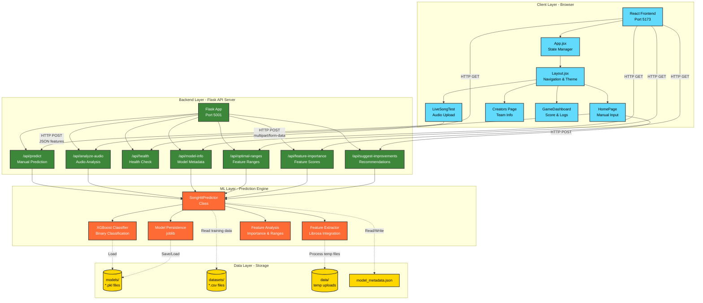

# System Architecture Diagram

This diagram illustrates the complete system architecture of the Song Virality Prediction System, showing all layers and their interactions.

## Diagram

## Architecture Layers

### 1. Client Layer (Frontend - Port 5173)
Built with **React + Vite**, provides the user interface:
- **App.jsx**: Main application state manager (score, logs, localStorage)
- **Layout.jsx**: Navigation, routing, and theme management
- **HomePage/PredictorForm**: Manual input for 12 musical features
- **LiveSongTest**: Audio file upload and analysis
- **Creators**: Team information page
- **GameDashboard**: Score tracking and prediction history

### 2. Backend Layer (Flask API - Port 5001)
RESTful API built with **Flask + CORS**:
- **POST /api/predict**: Accepts 12 features as JSON, returns prediction
- **POST /api/analyze-audio**: Accepts audio file, extracts features, returns prediction
- **GET /api/health**: Server health check
- **GET /api/model-info**: Model metadata and feature list
- **GET /api/optimal-ranges**: Optimal parameter ranges for hits
- **GET /api/feature-importance**: Feature importance scores
- **POST /api/suggest-improvements**: Improvement suggestions for low-scoring songs

### 3. ML Layer (Prediction Engine)
Core machine learning components:
- **SongHitPredictor Class**: Main predictor with training and prediction methods
- **XGBoost Classifier**: Binary classification model (~87% accuracy)
- **Librosa Integration**: Audio feature extraction from uploaded files
- **Feature Analysis**: Optimal ranges, importance scores, improvement suggestions

### 4. Data Layer (Storage)
Persistent storage:
- **models/**: Trained model files (*.pkl)
- **datasets/**: Training data (spotify_tracks.csv, spotify_songs.csv)
- **data/**: Temporary uploaded audio files
- **model_metadata.json**: Model version, accuracy, features

## Data Flow

1. **Manual Input Path**:
   - User enters 12 features in HomePage
   - POST to `/api/predict`
   - XGBoost model predicts hit probability
   - Results displayed with confidence score

2. **Audio Upload Path**:
   - User uploads audio file in LiveSongTest
   - POST to `/api/analyze-audio`
   - Librosa extracts 12 musical features
   - XGBoost model predicts hit probability
   - Results displayed with extracted features

## Technology Stack

- **Frontend**: React, Vite, CSS3
- **Backend**: Python, Flask, Flask-CORS
- **ML**: XGBoost, scikit-learn, pandas, numpy
- **Audio**: Librosa
- **Persistence**: joblib, JSON
- **Deployment**: Vercel (both frontend and backend)

## Communication Protocol

- **Protocol**: HTTP/REST
- **Data Format**: JSON (application/json) for predictions, multipart/form-data for audio uploads
- **CORS**: Enabled for frontend-backend communication
- **Ports**: Frontend (5173), Backend (5001)
