# Data Flow Diagram

This diagram illustrates the data preprocessing pipeline from raw CSV data to training-ready dataset.

## Diagram

```mermaid
flowchart TB
    Start([Raw CSV Data]) --> Load[Load CSV File<br/>pandas.read_csv<br/>engine=python<br/>on_bad_lines=skip]
    
    Load --> ErrorCheck1{Loading<br/>Successful?}
    ErrorCheck1 -->|Failed| Error1[Log Error:<br/>Invalid CSV format<br/>or file not found]
    Error1 --> End1([Abort Training])
    
    ErrorCheck1 -->|Success| ParseDates[Parse Dates:<br/>Extract year from date<br/>or use year column]
    ParseDates --> CreateYear[Create release_year<br/>column from year field]
    
    CreateYear --> DropNA1[Drop rows where<br/>release_year is NaT/null]
    
    DropNA1 --> ConvertNumeric[Convert Musical Features<br/>to Numeric:<br/>pd.to_numeric<br/>with errors='coerce']
    
    ConvertNumeric --> Features[Convert each feature:<br/>- danceability<br/>- energy<br/>- key<br/>- loudness<br/>- mode<br/>- speechiness<br/>- acousticness<br/>- instrumentalness<br/>- liveness<br/>- valence<br/>- tempo<br/>- duration_ms]
    
    Features --> DropNA2[Drop rows with NaN<br/>in any musical feature]
    
    DropNA2 --> CreateTarget[Create Binary Target:<br/>is_hit = 1 if popularity >= 50<br/>is_hit = 0 otherwise]
    
    CreateTarget --> ValidateTarget{Check<br/>Target Balance}
    ValidateTarget -->|Imbalanced| CalcWeights[Calculate Class Weights:<br/>weight_hits = n_samples/2*n_hits<br/>weight_non_hits = n_samples/2*n_non_hits]
    CalcWeights --> DropIDs
    ValidateTarget -->|Balanced| DropIDs[Remove ID Columns:<br/>- track_id<br/>- album_id<br/>- playlist_id<br/>- artwork_url<br/>- track_url<br/>- year keep release_year]
    
    DropIDs --> ValidateTypes{Validate Feature<br/>Data Types}
    ValidateTypes -->|Non-numeric found| Error2[Raise TypeError:<br/>Features must be numeric]
    Error2 --> End2([Abort Training])
    
    ValidateTypes -->|All numeric| CheckMissing{Check for<br/>Missing Features}
    CheckMissing -->|Features missing| Error3[Raise KeyError:<br/>Missing required features]
    Error3 --> End3([Abort Training])
    
    CheckMissing -->|All present| SelectFeatures[Select X Features:<br/>All 12 musical DNA features]
    SelectFeatures --> SelectTarget[Select Y Target:<br/>is_hit column]
    
    SelectTarget --> CalcHash[Calculate Data Hash:<br/>MD5 of DataFrame<br/>for change detection]
    
    CalcHash --> SplitData[Train-Test Split:<br/>80/20 ratio<br/>stratify=Y<br/>random_state=42]
    
    SplitData --> XTrain[X_train:<br/>Training features<br/>80% of data]
    SplitData --> XTest[X_test:<br/>Testing features<br/>20% of data]
    SplitData --> YTrain[Y_train:<br/>Training labels<br/>80% of data]
    SplitData --> YTest[Y_test:<br/>Testing labels<br/>20% of data]
    
    XTrain --> Ready[Training-Ready Dataset]
    XTest --> Ready
    YTrain --> Ready
    YTest --> Ready
    
    Ready --> ModelTraining[Ready for XGBoost<br/>Model Training]
    ModelTraining --> End4([Proceed to Training])
    
    %% Styling
    classDef input fill:#ffcccc,stroke:#333,stroke-width:2px
    classDef process fill:#cce5ff,stroke:#333,stroke-width:2px
    classDef validation fill:#ffffcc,stroke:#333,stroke-width:2px
    classDef error fill:#ff9999,stroke:#333,stroke-width:2px
    classDef output fill:#ccffcc,stroke:#333,stroke-width:2px
    
    class Start,Load input
    class ParseDates,CreateYear,DropNA1,DropNA2,ConvertNumeric,Features,CreateTarget,DropIDs,SelectFeatures,SelectTarget,CalcHash,SplitData,CalcWeights process
    class ErrorCheck1,ValidateTarget,ValidateTypes,CheckMissing validation
    class Error1,Error2,Error3 error
    class XTrain,XTest,YTrain,YTest,Ready,ModelTraining output
```



## Data Flow Steps

### Step 1: Data Loading
**Input**: Raw CSV file (spotify_tracks.csv or spotify_songs.csv)  
**Process**: 
- Use `pandas.read_csv()` with error handling
- `engine='python'` for flexibility
- `on_bad_lines='skip'` to skip problematic rows
**Output**: DataFrame with all columns

### Step 2: Date Parsing & Year Extraction
**Process**:
- Check for 'year' column (direct year values)
- If date column exists, extract year component
- Create `release_year` column
- Drop rows where release_year is null or NaT

### Step 3: Feature Type Conversion
**Process**:
- Convert all 12 musical DNA features to numeric
- Use `pd.to_numeric(errors='coerce')` to handle invalid values
- Coerced values become NaN
**Features Converted**:
1. danceability (0-1)
2. energy (0-1)
3. key (0-11)
4. loudness (-60 to 0 dB)
5. mode (0 or 1)
6. speechiness (0-1)
7. acousticness (0-1)
8. instrumentalness (0-1)
9. liveness (0-1)
10. valence (0-1)
11. tempo (BPM, typically 60-200)
12. duration_ms (milliseconds)

### Step 4: NaN Removal
**Process**:
- Drop all rows with NaN values in any of the 12 features
- Ensures clean data for training
**Reason**: XGBoost requires complete data (no missing values)

### Step 5: Target Variable Creation
**Process**:
- Use `popularity` or `track_popularity` column
- Convert to numeric with error coercion
- Define hit: `is_hit = 1 if popularity >= 50 else 0`
- This creates approximately 15-20% hit ratio (balanced)
**Note**: Threshold of 50 chosen over 70 to reduce class imbalance

### Step 6: Class Weight Calculation
**Why**: Handle class imbalance (more non-hits than hits)  
**Formula**:
```python
n_samples = total_samples
n_hits = count of is_hit==1
n_non_hits = count of is_hit==0
weight_hits = n_samples / (2 * n_hits)
weight_non_hits = n_samples / (2 * n_non_hits)
```
**Usage**: Used in XGBoost training to penalize missing hits more heavily

### Step 7: ID Column Removal
**Removed Columns**:
- track_id
- album_id (or track_album_id)
- playlist_id
- artwork_url
- track_url
- year (keeping release_year)
**Reason**: IDs don't contribute to prediction, can cause overfitting

### Step 8: Data Validation
**Checks**:
1. All 12 features present in DataFrame
2. All features have numeric data type
3. No missing required columns
**Errors**: KeyError or TypeError if validation fails

### Step 9: Feature Selection
**X (Features)**: 12 musical DNA features
```python
X = df[['danceability', 'energy', 'key', 'loudness', 'mode', 
        'speechiness', 'acousticness', 'instrumentalness', 
        'liveness', 'valence', 'tempo', 'duration_ms']]
```
**Y (Target)**: Binary hit classification
```python
Y = df['is_hit']  # 0 or 1
```

### Step 10: Data Hash Calculation
**Purpose**: Detect if dataset has changed since last training  
**Method**: MD5 hash of DataFrame content  
**Usage**: Skip retraining if data hasn't changed (unless force_retrain=True)

### Step 11: Train-Test Split
**Configuration**:
- **Ratio**: 80% training, 20% testing
- **Stratification**: `stratify=Y` maintains class balance in both sets
- **Random State**: 42 for reproducibility
**Output**: 
- X_train (80% of features)
- X_test (20% of features)
- Y_train (80% of labels)
- Y_test (20% of labels)

## Data Statistics

**Typical Dataset Size**: 
- Raw: ~114,000 songs (spotify_tracks.csv)
- After cleaning: ~110,000 songs
- Training set: ~88,000 songs
- Test set: ~22,000 songs

**Hit Distribution** (with popularity ≥ 50):
- Hits: ~15-20%
- Non-hits: ~80-85%

**Feature Ranges** (after cleaning):
- Continuous (0-1): danceability, energy, speechiness, acousticness, instrumentalness, liveness, valence
- Integer (0-11): key
- Float (-60 to 0): loudness
- Binary (0-1): mode
- Continuous (60-200): tempo
- Integer (0-3600000): duration_ms

## Error Handling

1. **CSV Load Error**: Invalid file format, file not found
2. **Type Conversion Error**: Non-numeric values in features
3. **Missing Feature Error**: Required column not in dataset
4. **Data Validation Error**: Feature types incorrect after conversion

## Notes

- Pipeline designed to handle various CSV formats (spotify_tracks, spotify_songs)
- Robust error handling at each step
- Class imbalance handled through weighting
- Data hash enables smart retraining (only when data changes)
- Stratified split ensures representative test set
