# Deployment Diagram

This diagram shows the deployment architecture for the Song Virality Prediction System on Vercel Cloud Platform.

## Diagram

```mermaid
graph TB
    subgraph "User Device"
        Browser[Web Browser]
    end
    
    subgraph "Vercel Cloud Platform"
        subgraph "Frontend Deployment"
            FrontDeploy[Vercel Frontend<br/>CDN Edge Network]
            FrontBuild[Build Process<br/>npm run build]
            FrontDist[Static Files<br/>frontend/dist/]
            FrontEnv[Environment<br/>Node.js 18.x]
            
            FrontBuild --> FrontDist
            FrontDist --> FrontDeploy
            FrontEnv -.-> FrontBuild
        end
        
        subgraph "Backend Deployment"
            BackDeploy[Vercel Serverless<br/>Function Runtime]
            BackApp[Flask App<br/>backend/app.py]
            BackEnv[Environment<br/>Python 3.9+]
            
            BackApp --> BackDeploy
            BackEnv -.-> BackApp
        end
        
        subgraph "Static Assets"
            Models[Model Files<br/>backend/models/<br/>*.pkl files]
            Datasets[Dataset Files<br/>datasets/<br/>*.csv files]
            TempDir[Temporary Storage<br/>/tmp/ directory]
        end
    end
    
    subgraph "External Dependencies"
        subgraph "Python Packages"
            Flask[Flask 2.x<br/>Web Framework]
            FlaskCORS[Flask-CORS<br/>Cross-Origin Support]
            XGB[XGBoost 1.7+<br/>ML Model]
            SKLearn[scikit-learn 1.0+<br/>ML Utilities]
            Pandas[pandas 1.5+<br/>Data Processing]
            Numpy[numpy 1.23+<br/>Numerical Computing]
            Librosa[librosa 0.10+<br/>Audio Analysis]
            Joblib[joblib 1.2+<br/>Model Persistence]
        end
        
        subgraph "Node Packages"
            React[React 18.x<br/>UI Framework]
            Vite[Vite 4.x<br/>Build Tool]
            ReactDOM[react-dom 18.x<br/>DOM Renderer]
        end
        
        subgraph "System Libraries"
            FFmpeg[ffmpeg<br/>Audio Codec]
            LibSndFile[libsndfile<br/>Audio I/O]
        end
    end
    
    %% User connections
    Browser -->|HTTPS<br/>Port 443| FrontDeploy
    Browser -->|API Requests<br/>HTTPS| BackDeploy
    
    %% Internal connections
    FrontDeploy -.->|API calls| BackDeploy
    BackApp -.->|Load models| Models
    BackApp -.->|Read training data| Datasets
    BackApp -.->|Write uploads| TempDir
    
    %% Dependencies
    BackApp -.->|imports| Flask
    BackApp -.->|imports| FlaskCORS
    BackApp -.->|imports| XGB
    BackApp -.->|imports| SKLearn
    BackApp -.->|imports| Pandas
    BackApp -.->|imports| Numpy
    BackApp -.->|imports| Librosa
    BackApp -.->|imports| Joblib
    
    FrontBuild -.->|uses| React
    FrontBuild -.->|uses| Vite
    FrontBuild -.->|uses| ReactDOM
    
    Librosa -.->|requires| FFmpeg
    Librosa -.->|requires| LibSndFile
    
    %% Styling
    classDef user fill:#e1f5ff,stroke:#333,stroke-width:2px
    classDef vercel fill:#000,stroke:#333,stroke-width:3px,color:#fff
    classDef frontend fill:#61dafb,stroke:#333,stroke-width:2px,color:#000
    classDef backend fill:#3c873a,stroke:#333,stroke-width:2px,color:#fff
    classDef storage fill:#ffd700,stroke:#333,stroke-width:2px,color:#000
    classDef deps fill:#ff9999,stroke:#333,stroke-width:2px,color:#000
    
    class Browser user
    class FrontDeploy,BackDeploy vercel
    class FrontBuild,FrontDist,FrontEnv frontend
    class BackApp,BackEnv backend
    class Models,Datasets,TempDir storage
    class Flask,FlaskCORS,XGB,SKLearn,Pandas,Numpy,Librosa,Joblib,React,Vite,ReactDOM,FFmpeg,LibSndFile deps
```



## Deployment Architecture

### 🌐 Vercel Cloud Platform

The entire application is deployed on **Vercel**, a cloud platform for static sites and serverless functions.

#### Frontend Deployment
- **Source**: `frontend/` directory
- **Build Command**: `npm run build` (Vite)
- **Output**: `frontend/dist/` directory
- **Deployment Type**: Static site on CDN edge network
- **Environment**: Node.js 18.x
- **URL**: Served from Vercel's global CDN

#### Backend Deployment
- **Source**: `backend/` directory
- **Entry Point**: `backend/app.py`
- **Deployment Type**: Serverless function
- **Environment**: Python 3.9+
- **Runtime**: Vercel's Python serverless runtime
- **API Routes**: `/api/*` paths

### 📦 Static Assets

#### Model Files (`backend/models/`)
- `song_hit_model.pkl`: Trained XGBoost classifier (~5 MB)
- `song_hit_model_features.pkl`: Feature names array (~1 KB)
- `model_metadata.json`: Training metadata (~2 KB)
- **Included in deployment**: Yes, bundled with backend

#### Dataset Files (`datasets/`)
- `spotify_tracks.csv`: Main dataset (~19 MB, 114K songs)
- `spotify_songs.csv`: Alternative dataset (~8 MB)
- **Included in deployment**: Yes, for potential retraining
- **Usage**: Training data (not used during prediction)

#### Temporary Storage (`/tmp/`)
- **Purpose**: Store uploaded audio files during processing
- **Lifecycle**: Created on upload, deleted after feature extraction
- **Vercel Limit**: 512 MB temporary storage per function
- **Cleanup**: Automatic after request completion

### 📚 External Dependencies

#### Python Packages (Backend)
Defined in `backend/requirements.txt`:
```
Flask==2.3.0
flask-cors==4.0.0
xgboost==1.7.6
scikit-learn==1.3.0
pandas==2.0.3
numpy==1.24.3
librosa==0.10.0
joblib==1.3.1
soundfile==0.12.1
```

**Key Dependencies**:
- **Flask**: Web framework for API endpoints
- **Flask-CORS**: Enable cross-origin requests from frontend
- **XGBoost**: Gradient boosting model for predictions
- **scikit-learn**: ML utilities (train_test_split, metrics)
- **pandas**: Data manipulation and DataFrame operations
- **numpy**: Numerical computing
- **librosa**: Audio feature extraction
- **joblib**: Model serialization/deserialization
- **soundfile**: Audio file I/O (librosa dependency)

#### Node Packages (Frontend)
Defined in `frontend/package.json`:
```json
{
  "react": "^18.2.0",
  "react-dom": "^18.2.0",
  "vite": "^4.4.5"
}
```

**Key Dependencies**:
- **React**: UI component library
- **react-dom**: DOM rendering for React
- **Vite**: Build tool and dev server

#### System Libraries
- **ffmpeg**: Audio codec library (required by librosa)
- **libsndfile**: Sound file I/O library (required by soundfile)
- **Note**: These are automatically available in Vercel's Python runtime

### 🔧 Configuration Files

#### vercel.json (Root)
```json
{
  "buildCommand": "cd frontend && npm install && npm run build",
  "outputDirectory": "frontend/dist",
  "framework": "vite",
  "rewrites": [
    { "source": "/api/(.*)", "destination": "/backend/app.py" }
  ]
}
```

**Purpose**: 
- Configure build process
- Route API requests to backend
- Specify output directory

### 🚀 Deployment Process

#### Frontend Deployment Flow
1. **Trigger**: Git push to main branch or manual deployment
2. **Install**: `npm install` in `frontend/` directory
3. **Build**: `npm run build` (Vite creates optimized bundle)
4. **Output**: Static files in `frontend/dist/`
5. **Deploy**: Upload to Vercel CDN edge network
6. **CDN**: Distributed globally for fast access

#### Backend Deployment Flow
1. **Trigger**: Git push to main branch or manual deployment
2. **Install**: `pip install -r backend/requirements.txt`
3. **Bundle**: Include `backend/app.py` and dependencies
4. **Deploy**: Upload as serverless function
5. **Runtime**: Python 3.9+ serverless environment
6. **API**: Available at `/api/*` routes

### 🔒 Environment Variables

#### Backend (Optional)
- `FLASK_PORT`: API port (default: 5001, not needed on Vercel)
- `MODEL_DIR`: Model directory (default: `models/`)
- `DATA_DIR`: Data directory (default: `datasets/`)

#### Frontend (Optional)
- `VITE_API_URL`: Backend API URL (auto-detected in Vercel)

### 📊 Resource Limits (Vercel)

#### Serverless Function Limits
- **Memory**: 1024 MB (default)
- **Duration**: 10 seconds per request
- **Payload**: 4.5 MB request/response size
- **Temp Storage**: 512 MB `/tmp/` directory

#### CDN Limits
- **Bandwidth**: Unlimited for Pro plan
- **Regions**: Global edge network
- **Cache**: Automatic caching of static assets

### 🔄 Continuous Deployment

- **GitHub Integration**: Automatic deployment on push to main branch
- **Preview Deployments**: Each PR gets a unique preview URL
- **Rollback**: Easy rollback to previous deployments
- **Build Logs**: Accessible in Vercel dashboard

### 🔍 Monitoring & Observability

- **Logs**: Available in Vercel dashboard
- **Analytics**: Page views, API usage
- **Error Tracking**: Automatic error detection
- **Performance**: Function execution time, cold starts

### 🌍 Global Distribution

- **Frontend**: Served from nearest CDN edge location
- **Backend**: Serverless functions run in closest region
- **Low Latency**: Global edge network ensures fast response
- **Auto-Scaling**: Automatically scales with traffic

## Deployment Best Practices

1. **Model Size**: Keep model files under 50 MB for fast deploys
2. **Dependencies**: Minimize package count for faster cold starts
3. **Caching**: Leverage CDN caching for static assets
4. **Error Handling**: Comprehensive error handling in API routes
5. **Monitoring**: Regular checks of Vercel logs and analytics
6. **Version Control**: Tag releases for easy rollback
7. **Environment Variables**: Use for configuration, not secrets in code

## Security Considerations

1. **HTTPS**: All traffic encrypted via HTTPS
2. **CORS**: Configured to allow frontend domain only
3. **Input Validation**: All API inputs validated
4. **File Upload**: Temporary files cleaned up immediately
5. **No Secrets**: No API keys or secrets required
6. **Read-Only**: Models and datasets are read-only after deployment
