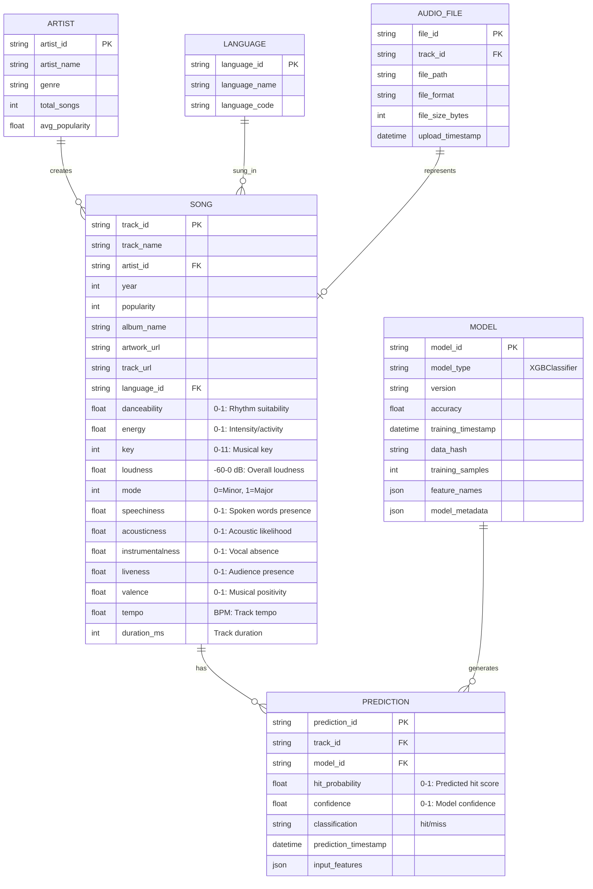

# Entity Relationship Diagram (ERD)

This diagram shows the data model for the Song Virality Prediction System, including all entities and their relationships.

## Diagram

## Entity Descriptions

### SONG
The core entity representing a musical track with all 12 musical DNA features used for prediction:
- **Rhythm Features**: danceability, tempo, duration_ms
- **Energy Features**: energy, loudness, valence
- **Texture Features**: acousticness, instrumentalness, speechiness, liveness
- **Tonal Features**: key, mode

### ARTIST
Represents the creator of songs, linked to one or more tracks.

### LANGUAGE
Represents the language of the song lyrics (e.g., English, Tamil, Spanish).

### AUDIO_FILE
Stores uploaded audio files that can be analyzed to extract musical features.

### PREDICTION
Records each prediction made by the system, including:
- Predicted hit probability (0-1 scale)
- Confidence score
- Classification result (hit/miss)
- Timestamp and input features

### MODEL
Stores metadata about the trained ML model:
- Model type (XGBoost Classifier)
- Training accuracy (~87%)
- Training date and data hash
- Feature names and importance

## Key Relationships

1. **SONG ↔ PREDICTION**: One song can have multiple predictions over time
2. **ARTIST ↔ SONG**: One artist creates multiple songs
3. **LANGUAGE ↔ SONG**: Songs are sung in one language
4. **AUDIO_FILE ↔ SONG**: Each audio file represents one song
5. **MODEL ↔ PREDICTION**: One model generates multiple predictions

## Notes

- The 12 musical DNA features are the primary predictors for hit probability
- Songs with popularity ≥ 50 are classified as "hits" (target threshold)
- The system uses binary classification: hit (1) or miss (0)
