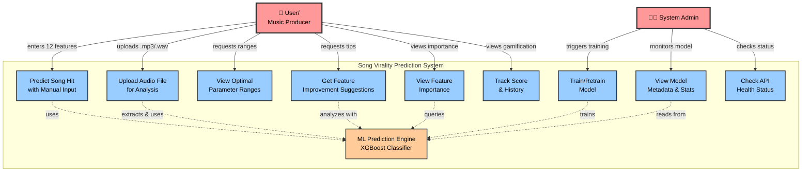

# Use Case Diagram

This diagram shows the actors and their interactions with the Song Virality Prediction System.

## Diagram

## Actors

### 👤 User / Music Producer
The primary user of the system who wants to predict if their song will be a hit.

**Goals:**
- Predict song hit probability
- Understand what makes a song successful
- Improve their music based on data-driven insights

### 👨‍💼 System Admin
Technical administrator who manages the ML model and system health.

**Goals:**
- Ensure model accuracy and performance
- Monitor system health
- Retrain model with new data when needed

## Use Cases

### User Use Cases

#### UC1: Predict Song Hit with Manual Input
**Description**: User manually enters 12 musical DNA features to get prediction  
**Input**: danceability, energy, key, loudness, mode, speechiness, acousticness, instrumentalness, liveness, valence, tempo, duration_ms  
**Output**: Hit probability (0-100%), confidence score, classification (hit/miss)  
**Flow**:
1. User navigates to Home page
2. Enters all 12 features in form
3. Clicks "Predict"
4. System validates input
5. XGBoost model predicts hit probability
6. Results displayed with visual indicators

#### UC2: Upload Audio File for Analysis
**Description**: User uploads an audio file (MP3, WAV) for automatic feature extraction and prediction  
**Input**: Audio file (.mp3, .wav, .flac)  
**Output**: Extracted features + hit probability prediction  
**Flow**:
1. User navigates to "Live Test" page
2. Uploads audio file
3. Librosa extracts 12 musical features
4. Features automatically sent to prediction engine
5. Results displayed with extracted values

#### UC3: View Optimal Parameter Ranges
**Description**: User views optimal ranges for each musical feature based on hit songs  
**Output**: Min/max/optimal values for each of 12 features  
**Use Case**: Understanding what values typically lead to hits

#### UC4: Get Feature Improvement Suggestions
**Description**: For songs with low hit probability, system suggests which features to adjust  
**Input**: Current feature values  
**Output**: Top 5 suggestions with direction (INCREASE/DECREASE), expected improvement  
**Condition**: Typically shown when hit probability < 70%

#### UC5: View Feature Importance
**Description**: User views which features are most important for hit prediction  
**Output**: Ranked list of features with importance scores  
**Use Case**: Understanding which musical characteristics matter most

#### UC9: Track Score & History
**Description**: User views their prediction history and gamification score  
**Output**: Total score, recent predictions, bonus points for high confidence  
**Storage**: LocalStorage in browser

### Admin Use Cases

#### UC6: Train/Retrain Model
**Description**: Admin triggers model training or retraining with new data  
**Input**: CSV dataset with labeled songs (hit/miss)  
**Output**: Trained model, accuracy metrics, feature importance  
**Trigger**: New data available, scheduled retraining, performance degradation

#### UC7: View Model Metadata & Stats
**Description**: Admin views model version, accuracy, training date, data hash  
**Output**: Model metadata JSON with all stats  
**Use Case**: Monitoring model performance and versioning

#### UC8: Check API Health Status
**Description**: Admin checks if backend server and model are loaded correctly  
**Endpoint**: GET /api/health  
**Output**: Status (ok/error), model loaded status, version

## System Component

### 🤖 ML Prediction Engine (XGBoost Classifier)
The core machine learning component that:
- Loads trained model from disk
- Predicts hit probability for input features
- Provides feature analysis and suggestions
- Achieves ~87% accuracy on test set

## Relationships

- **User → Use Cases**: Primary interactions for predictions and insights
- **Admin → Use Cases**: System management and monitoring
- **Use Cases → ML Engine**: All prediction-related use cases depend on the ML component
- **Dependencies**: UC2 extends UC1 (audio upload → feature extraction → prediction)

## Notes

- Use cases UC1-UC5 and UC9 are accessible via the React frontend
- Use cases UC6-UC8 may require direct API access or admin interface
- All prediction use cases ultimately rely on the XGBoost classifier
- System stores user data (score, logs) in browser LocalStorage (no server-side persistence)
